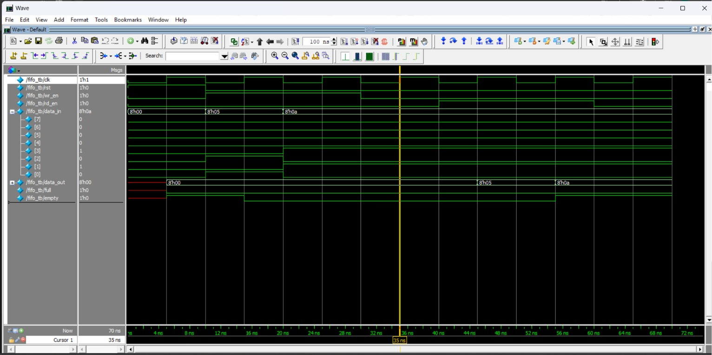

# Synchronous FIFO Design and Verification

## Overview
This project implements a Synchronous FIFO (First-In First-Out) memory using Verilog/SystemVerilog. The FIFO is designed to store and retrieve data in the same order in which it is written. Both read and write operations are synchronized to a single clock.

## Features
- Synchronous FIFO architecture
- Full flag generation
- Empty flag generation
- Write operation support
- Read operation support
- Circular buffer implementation
- Simulation and waveform verification

## Project Files

| File Name | Description |
|------------|-------------|
| fifo.sv | FIFO RTL Design |
| fifo_tb.sv | Testbench for verification |
| fifo_run.do | QuestaSim simulation script |
| image.png | Simulation waveform output |

## Verification Performed
The following test cases were verified:

1. FIFO Reset Operation
2. FIFO Write Operation
3. FIFO Read Operation
4. FIFO Full Condition
5. FIFO Empty Condition
6. Simultaneous Read and Write Operations

## Simulation Tool
- Siemens QuestaSim

## Language Used
- Verilog/SystemVerilog

## Waveform Result

Add the waveform screenshot below:

## Future Improvements
- Self-checking testbench
- SystemVerilog Assertions (SVA)
- Functional Coverage
- Parameterized FIFO Depth and Width
- UVM-based Verification Environment

## Author
**Chandan D**

Final Year Student  
VLSI Design and Verification
